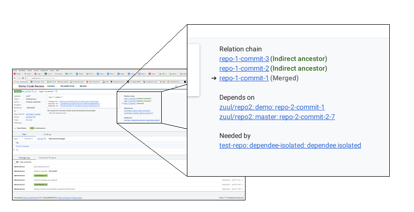
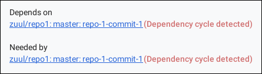
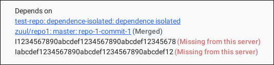

The @PLUGIN@ plugin detects Zuul [cross repository dependencies]&nbsp;(CRD) in
commit messages and displays them on the Gerrit UI as "Depends on" and "Needed
by" sections in the related changes section.

[Dependency cycles] (although currently only direct dependencies are considered) get highlighted

And dependencies that are not available on the server get highlighted too.

The cross repository dependencies are also exposed through the [REST API](rest-api-changes.html).

This plugin currently does not support URL based dependencies, but only
`Change-Id` dependencies, which got deprecated in Zuul v3.

[cross repository dependencies]: https://zuul-ci.org/docs/zuul/discussion/gating.html#cross-project-dependencies
[Dependency cycles]: https://zuul-ci.org/docs/zuul/discussion/gating.html#cycles
